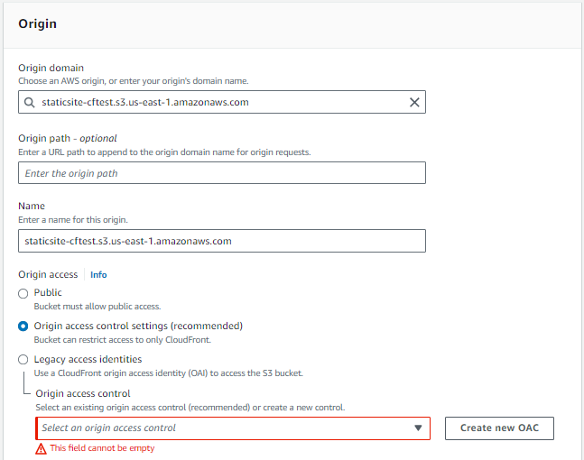
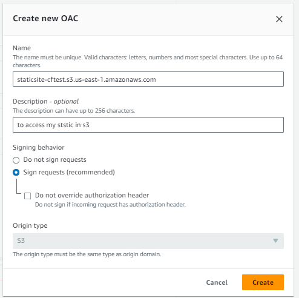
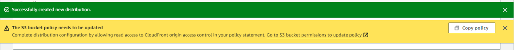
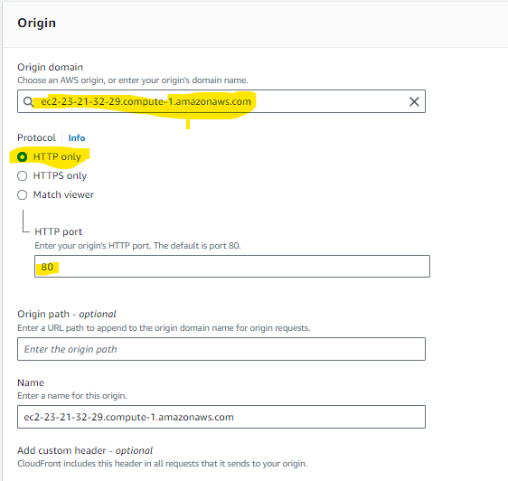
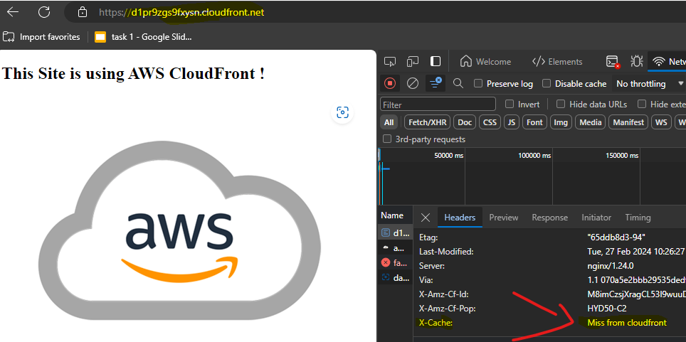
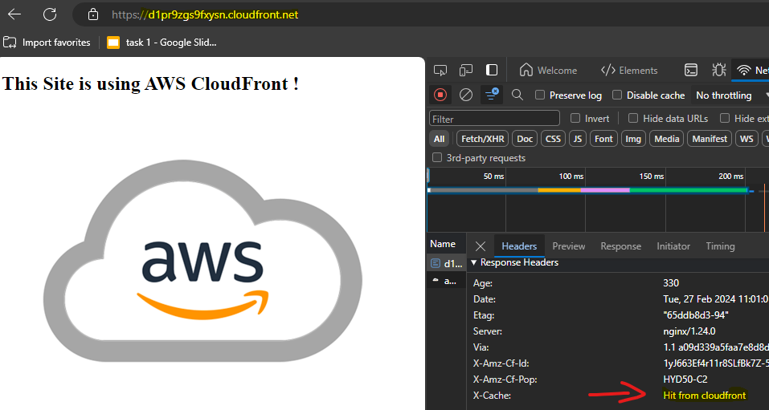

# AWS CloudFront CDN

## Pusblishing a Site from S3 Bucket
Resource : [click Here](https://youtu.be/GUfAQUjA3a0)

- Create a New S3 Bucket & Upload the Files on the Site Folder [Click Here](./site/)

- Navigate to Cloudfront & Create a new CF Distribution

- Choose the Origin Details 

    

- Create a Origin Access Control like this

    

- For a Ststic simple test site leve the rest of the options a it is.

- You can Enable / Disable WAF .

- Make sure to mention the Root object a ``index.html`` (based on my site)

- Use this Alert Menu to Copy the Auto generated policy and attach it to the s3 bucket
  
    

- Now copy the ``Distribution domain name`` and paste it ina new window. 

- open Web broswer Dev tools (f12 key) and choose network section and inspect the page.

- Use this tool [https://tools.keycdn.com/performance](https://tools.keycdn.com/performance) to check the Load times of the page from multiple Regions.

## Pusblishing a Site from Ec2 Instance + Nginx 

Resource : [Click Here](https://youtu.be/AjlUFYnScBk)

- Create a New Instance with AL23 AMI and install nginx

- Move the contents of the Site Folder [Click Here](./site/) to the NGINX root location ``/usr/share/nginx/html
``

- Now Access the webpage using the `Public IPv4 DNS` of that instance

- Create a New CF Distribution & Enter the details like this

    

- use the `Public IPv4 DNS` of that instance as origin Domain

- You can define your `caching Policy`

- choose the Default root Object as `index.html`

- Leave the rest as default as we are simply testing this feature

- Create it

## Results

- When it is server from Server 

    

- When it is Serving from CF 

    
